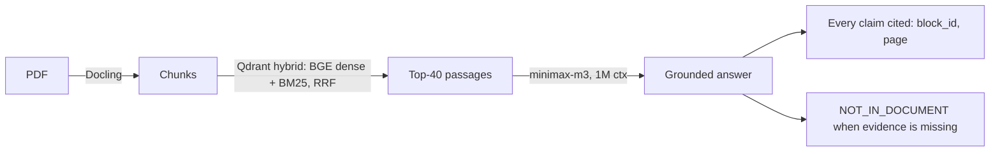

# ContextIQ

Grounded question-answering over large documents — 10-Ks, annual reports, filings, contracts. ContextIQ ingests a PDF, retrieves the relevant passages with hybrid search, and answers with an LLM that **cites every claim** and **refuses to answer when the evidence isn't there**.

## Why it exists

QA over long financial documents is deceptively hard: the answer to "what's the quick ratio?" lives in a balance-sheet table whose vocabulary ("current assets", "current liabilities") never matches the question. Naive RAG scores ~19% on FinanceBench. ContextIQ is a deliberately lean pipeline that does markedly better while staying honest about what it doesn't know.

## Results

Measured on **FinanceBench** (Patronus AI — human-verified questions over public 10-Ks). Answer accuracy is scored by an LLM judge against the gold answers:

| Pipeline | Answer accuracy |
| --- | ---: |
| Naive shared-store RAG (published baseline) | 0.19 |
| **ContextIQ — hybrid retrieve → minimax-m3** | **0.476** (2.5×) |

Subset: the 21 hardest *analytical* questions across AMD / American Express / Boeing 2022 10-Ks (liquidity ratios, revenue and margin drivers). No reranker, no OCR, no query expansion — just hybrid retrieval and a grounded answer. It's a floor, not a ceiling: these are the benchmark's hardest questions, and the remaining failures are table-retrieval misses. Reproduce:

```bash
uv run contextiq ingest evals/financebench/pdfs/AMD_2022_10K.pdf
PYTHONPATH=src python evals/financebench/run_answers.py --limit 0
```

## How it works



- **Retrieve** — one Qdrant query fuses dense (BGE-small) + sparse (BM25) with reciprocal-rank fusion, scoped to the document. Degrades to a keyword scan if the index is unavailable.
- **Answer** — retrieved passages go to minimax-m3 (via OpenRouter) under a strict grounding prompt: cite each factual claim, keep evidence separate from interpretation, and emit `NOT_IN_DOCUMENT` rather than guess.
- **Reliability** — transient API failures are retried; unsupported answers are refused, not hallucinated.

## Quick start

```bash
uv sync --extra dev --extra ui
cp .env.example .env            # set OPENROUTER_API_KEY
uv run contextiq ingest data/raw/sample-contract.md
uv run contextiq ask "What obligations does the contract place on each party?"
```

Web UI / API:

```bash
uv run contextiq-ui     # Gradio dashboard
uv run contextiq-api    # FastAPI backend on http://127.0.0.1:8000
```

Without an `OPENROUTER_API_KEY`, ContextIQ returns a safe extractive fallback so the demo still runs offline.

## Stack

Python · Qdrant (hybrid vector index) · BGE-small dense + BM25 sparse (FastEmbed) · Docling (PDF/table parsing) · minimax-m3 via OpenRouter (answer synthesis) · FastAPI · Gradio · Typer CLI · pytest.

Answer model is env-driven: swap via `CONTEXTIQ_OPENROUTER_MODEL`, or set `CONTEXTIQ_LLM_PROVIDER=anthropic` to use Claude with the Anthropic Citations API.

## Honest limitations & next steps

- The FinanceBench number is a 21-question subset (3 docs); the full 150-Q run needs the remaining PDFs downloaded.
- Failure mode is **table retrieval** (balance-sheet line items). Identified next levers, in order: a reranker, table-aware OCR, and contextual-retrieval prefixing.
