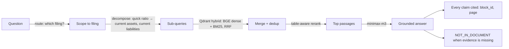

# ContextIQ

**Ask a financial filing a question — get a cited answer, or an honest "not in the document."**

ContextIQ answers natural-language questions about 10-Ks, 10-Qs, and annual reports. It finds the right filing, pulls the exact figures (even from dense balance-sheet tables), and grounds every claim in a page citation. When the evidence isn't there, it says so instead of guessing.

```text
Q:  What is AMD's quick ratio for FY22?

A:  ≈ 1.57 — computed from the FY22 balance sheet:
    (cash & equivalents $4,835M + short-term investments $1,020M + receivables $4,126M)
    ÷ current liabilities.                                  [cited: AMD_2022_10K, page 56]
```

The number lives in a balance-sheet table whose words ("current assets", "current liabilities") never match the question — so naive RAG can't find it and scores just **~19%** on FinanceBench. ContextIQ closes that gap with a small, deliberate agentic step, and stays honest about what it can't answer.

## Results

Measured on **FinanceBench** (Patronus AI — human-verified questions over public filings), answer accuracy scored by an LLM judge against the gold answers, over **52 questions · 12 companies · 8 sectors** (tech, finance, aerospace, consumer, industrial, energy, retail, healthcare):

| How it's asked | ContextIQ | FinanceBench (published) |
| --- | ---: | ---: |
| **Across a corpus** — you don't say which filing | **0.71** | naive RAG **0.19** · single-store 0.50 |
| **One filing** — "chat with this 10-K" | **~0.79** | long-context **0.79** · oracle 0.85 |
| Same, but *without* the agentic step | 0.48 | — |

On the benchmark's *hardest analytical* questions, the corpus setting beats naive RAG **3.7×** — and answers nearly everything instead of refusing 68% of the time. The single-filing number matches published long-context. (Figures are ranges: ±1 question of LLM nondeterminism.)

```bash
# reproduce the corpus number
uv run contextiq ingest evals/financebench/pdfs/AMD_2022_10K.pdf
PYTHONPATH=src python evals/financebench/run_answers.py --limit 0 --corpus
```

## How it works



1. **Route** — one LLM call picks the target filing, so "current assets" doesn't pull every company's balance sheet. (Skipped when only one document is ingested.)
2. **Decompose** — rewrites the question into its underlying line items, so search can find the balance-sheet table plain retrieval misses. *This single step lifts the hardest questions from 0.48 → ~0.79.*
3. **Retrieve + rerank** — hybrid dense (BGE) + BM25 with RRF per sub-query, merged, then a table-aware LLM rerank keeps the useful blocks (tables included) in budget.
4. **Answer** — minimax-m3 under a strict grounding prompt: cite every claim, separate evidence from interpretation, and say `NOT_IN_DOCUMENT` rather than guess.

That's it — one route + one decompose + one rerank call. No multi-agent orchestration; every step was measured head-to-head before it earned its place.

## Quick start

```bash
uv sync --extra dev --extra ui
cp .env.example .env            # set OPENROUTER_API_KEY
uv run contextiq ingest data/raw/sample-contract.md
uv run contextiq-ui             # Gradio dashboard  (or contextiq-api for the FastAPI backend)
```

Without an `OPENROUTER_API_KEY` it returns a safe extractive fallback so the demo still runs offline. Agentic retrieve is on by default (`CONTEXTIQ_AGENTIC`) and degrades to plain hybrid when no model client is available.

## Stack

Python · Qdrant (hybrid vector index) · BGE-small dense + BM25 sparse (FastEmbed) · Docling (PDF/table parsing) · minimax-m3 via OpenRouter (routing, decomposition, rerank, synthesis) · FastAPI · Gradio · Typer CLI · pytest.

Model is env-driven: swap with `CONTEXTIQ_OPENROUTER_MODEL`, or set `CONTEXTIQ_LLM_PROVIDER=anthropic` for Claude + the Anthropic Citations API.

## Honest limitations

- Validated on 12 companies / 52 questions — diverse, but not the full FinanceBench 150.
- Routing recovers most, not all, of the single-filing quality (corpus 0.71 vs ~0.79).
- Agentic adds ~3 model calls per question over plain retrieval.
