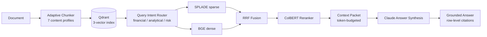

# ContextIQ

ContextIQ is an enterprise RAG system for large, complex documents — 10-Ks, annual reports, legal filings, technical specs. It ingests, chunks adaptively by content type, retrieves with a 3-stage neural pipeline (SPLADE + RRF + ColBERT), and returns grounded answers with row-level citations.

## Demo

> _Screenshots and walkthrough video: TBD — to be added before public release._

```bash
contextiq ingest data/raw/apple-2025-10k.pdf
contextiq ask "What were Apple's total net sales, broken down by Products vs Services?"
# adaptive chunks | SPLADE + ColBERT retrieval | grounded answer with page citations
```

## Stack

Python · FastAPI · Qdrant (vector index) · BGE-small-en (dense) · SPLADE (neural sparse) · ColBERT (late interaction reranker) · Anthropic Claude (answer synthesis) · pytest · Typer (CLI) · YAML specs for agents/MCP/evals.

## Results Snapshot

**Enterprise pipeline** (SPLADE + RRF + ColBERT reranking) vs lexical baseline on 11 benchmark queries across Apple and NVIDIA annual reports:

| Metric | Lexical baseline | Enterprise RAG |
| --- | ---: | ---: |
| Retrieval Recall@10 | 0.556 | 0.736 |
| Retrieval MRR | 0.667 | 0.735 |
| Keyword overlap score (11 queries) | 0.291 avg | 0.312 avg |
| ColBERT rerank score (financial) | — | 17–24 range |
| Answer confidence (6 E2E questions) | — | High on 5/6 |

Enterprise pipeline wins on semantic and analytical queries; lexical baseline holds on exact-number lookups where query tokens appear verbatim in table cells. ColBERT scores in the 20+ range consistently surface the right blocks for NVIDIA earnings and Apple litigation questions.

See [docs/benchmarks.md](docs/benchmarks.md) for full eval methodology.

## Quick Install

```bash
uv sync --extra dev
uv run contextiq --help
uv run pytest
```

## Run The App

Run the backend:

```bash
uv run contextiq-api
```

Then open `http://127.0.0.1:8000`.

The dashboard supports two modes:

- `Answer with Evidence`: retrieval plus grounded answer synthesis.
- `Build Context Only`: retrieval trace without an LLM call.

Set `ANTHROPIC_API_KEY` for Anthropic answer synthesis. Without a key, ContextIQ returns a safe extractive fallback so the demo still runs locally.

## Architecture



**Adaptive Chunker** classifies each block into one of 7 content profiles — `financial_table`, `risk_section`, `narrative_para`, `numerical_fact`, `list_items`, `heading`, `generic` — and applies the optimal chunking strategy per profile. The **Query Intent Router** maps query type to retrieval config: financial queries go sparse-heavy (SPLADE dominant), analytical queries go dense-heavy, risk queries get balanced retrieval biased toward risk section blocks.

## Highlights

- Adaptive chunking with 7 content profiles and 4 chunking strategies (whole, split, deduplicate, hierarchical).
- 3-stage enterprise retrieval: SPLADE neural sparse + BGE dense → RRF fusion → ColBERT reranking.
- Query intent routing — financial/analytical/risk queries each get a tuned retrieval config.
- Token-aware context packet assembly with dropped-candidate tracking and ColBERT score metadata.
- Grounded answer synthesis with row-level citations, confidence levels, and explicit gap reporting.
- Extractive fallback when no API key is set — demo runs fully offline.
- Retrieval eval contracts and qrels for repeatable quality checks.

See [docs/code-flow.md](docs/code-flow.md) for the function-level execution map.

The retrieval, MCP, and eval contracts live in:

- [specs/agents.yaml](specs/agents.yaml)
- [specs/mcp-tools.yaml](specs/mcp-tools.yaml)
- [specs/evals.yaml](specs/evals.yaml)

## Demo Commands

```bash
uv run contextiq ingest data/raw/sample-contract.md
uv run contextiq ask "What are the main regulatory risks? Cite pages."
curl -X POST http://127.0.0.1:8000/answer \
  -H 'Content-Type: application/json' \
  -d '{"question":"What obligations does the contract mention?","limit":6}'
uv run contextiq inspect-context
```

## Evaluation

```bash
uv run contextiq eval-retrieval --limit 20 --k 10
make eval
```

---

## Roadmap

### ✅ Foundation (shipped)
- Structural ingestion — PDF, Markdown, spreadsheets
- Qdrant vector index with fallback in-memory store
- BM25 lexical retrieval + dense semantic retrieval
- ContextPacket assembly with token budgeting
- Grounded answer synthesis with extractive fallback
- CLI, FastAPI backend, eval harness

### ✅ Enterprise RAG Sprint (shipped)
- Adaptive chunker with 7 content profiles and per-profile chunking strategies
- 3-vector Qdrant collection: BGE-small-en (dense) + SPLADE (neural sparse) + ColBERT (late interaction)
- INT8 scalar quantization for 4× memory reduction
- RRF fusion of dense + sparse candidates before ColBERT reranking
- Query Intent Router: financial → sparse-heavy, analytical → dense-heavy, risk → prose-biased
- Full corpus indexing: 7,720 blocks across Apple, NVIDIA, Microsoft, NASA filings
- Row-level citations with block ID, page number, and ColBERT confidence score
- E2E validation: 5/6 benchmark questions answered with high confidence

### 🚧 Agentic RAG — Coming Soon

> One-shot retrieval has a ceiling. Agentic RAG breaks through it.

The next phase replaces single-shot retrieval with an agent loop that thinks, retrieves iteratively, and builds a complete evidence picture before answering.

**Query Planning Agent** — decomposes a complex question into 2–4 targeted sub-queries, each with its own search strategy (sparse-heavy for exact figures, dense-heavy for analytical reasoning).

**Iterative Retrieval Loop** — runs each sub-query, checks evidence coverage, and decides whether to re-query with a refined strategy or proceed to synthesis.

**Multi-hop Reasoning** — connects evidence across documents and sections (e.g., cross-referencing Apple's tariff risk disclosures with their supply chain notes).

**Evidence Ranker** — scores and deduplicates evidence blocks across sub-queries before building the final context packet.

**Confidence-Gated Synthesis** — the synthesis agent rates its own confidence per claim; low-confidence claims trigger a targeted follow-up retrieval pass before the final answer is returned.

```
User Question
    ↓
[Query Planner]    →  sub-query 1, sub-query 2, sub-query 3
    ↓
[Retrieval Loop]   →  SPLADE + ColBERT per sub-query
    ↓
[Evidence Merger]  →  dedup, rank, token-budget
    ↓
[Synthesis Agent]  →  grounded answer + confidence gate
    ↓
Grounded Answer with multi-source citations
```

This directly addresses the class of questions where the answer is scattered across sections — tariff disclosures buried in a 100-page risk section, litigation details split across footnotes, multi-year trend analysis that requires joining financial tables across pages.
