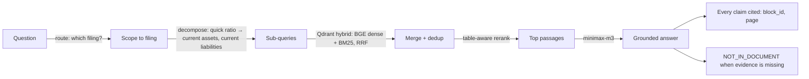

# ContextIQ

Grounded question-answering over financial filings — 10-Ks, 10-Qs, annual reports. ContextIQ ingests PDFs, routes a question to the right filing, decomposes it into the underlying line items, retrieves with hybrid search, and answers with an LLM that **cites every claim** and **refuses to answer when the evidence isn't there**.

## Why it exists

QA over long financial documents is deceptively hard: the answer to "what's the quick ratio?" lives in a balance-sheet table whose vocabulary ("current assets", "current liabilities") never matches the question. Naive RAG scores ~19% on FinanceBench. ContextIQ is a deliberately lean, *simple-agentic* pipeline that does markedly better while staying honest about what it doesn't know.

## Results

Measured on **FinanceBench** (Patronus AI — human-verified questions over public filings). Answer accuracy is scored by an LLM judge against the gold answers, over **52 questions across 12 companies and 8 sectors** (tech, finance, aerospace, consumer, industrial, energy, retail, healthcare).

| Setting | ContextIQ | FinanceBench published |
| --- | ---: | ---: |
| **Multi-document corpus** (router picks the filing) | **0.71** | shared vector store: **0.19** · single store: 0.50 |
| **Per-document** (chat with one filing) | **~0.79** (0.71–0.86, hardest subset) | long-context: **0.79** · oracle: 0.85 |
| Plain hybrid retrieve (no agentic), per-document | 0.48 | — |

On FinanceBench's *hardest analytical* questions, the corpus setting beats the published shared-store baseline **3.7×** (and tops single-vector-store), while answering nearly everything instead of refusing 68% of the time. The per-document number matches published long-context. Numbers wobble ±1 question on LLM nondeterminism — reported as ranges, not points. Reproduce:

```bash
uv run contextiq ingest evals/financebench/pdfs/AMD_2022_10K.pdf
PYTHONPATH=src python evals/financebench/run_answers.py --limit 0 --corpus   # routed corpus
```

## How it works



- **Route** — one LLM call picks the target filing from the corpus (so "current assets" doesn't pull every company's balance sheet). Skipped when only one document is ingested.
- **Decompose** — rewrites a concept question into its underlying line items, so hybrid search can find the balance-sheet table that plain retrieval misses. This single step lifts the hardest questions from 0.48 → ~0.79.
- **Retrieve + rerank** — hybrid dense (BGE) + BM25 with RRF per sub-query, merged/deduped, then a table-aware LLM rerank keeps the most useful blocks (including tables) in budget.
- **Answer** — minimax-m3 (via OpenRouter) under a strict grounding prompt: cite each claim, keep evidence separate from interpretation, and emit `NOT_IN_DOCUMENT` rather than guess.

No multi-agent orchestration — one route + one decompose + one rerank call. Every added component was measured head-to-head before adoption.

## Quick start

```bash
uv sync --extra dev --extra ui
cp .env.example .env            # set OPENROUTER_API_KEY
uv run contextiq ingest data/raw/sample-contract.md
uv run contextiq-ui             # Gradio dashboard  (or contextiq-api for the FastAPI backend)
```

Without an `OPENROUTER_API_KEY`, ContextIQ returns a safe extractive fallback so the demo still runs offline. Agentic retrieve is on by default (`CONTEXTIQ_AGENTIC`) and falls back to plain hybrid when no model client is available.

## Stack

Python · Qdrant (hybrid vector index) · BGE-small dense + BM25 sparse (FastEmbed) · Docling (PDF/table parsing) · minimax-m3 via OpenRouter (routing, decomposition, rerank, synthesis) · FastAPI · Gradio · Typer CLI · pytest.

Answer model is env-driven: swap via `CONTEXTIQ_OPENROUTER_MODEL`, or set `CONTEXTIQ_LLM_PROVIDER=anthropic` to use Claude with the Anthropic Citations API.

## Honest limitations & next steps

- Validated on 12 companies / 52 questions — strong and diverse, but not the full FinanceBench 150. A broad claim needs the remaining filings ingested.
- Routing recovers most but not all of the per-document quality (corpus 0.71 vs scoped ~0.79); routing errors and cross-company ambiguity are the gap.
- ±1 question of LLM variance — treat every number as a range.
- Agentic adds ~3 model calls per question (route + decompose + rerank) over plain retrieve.
