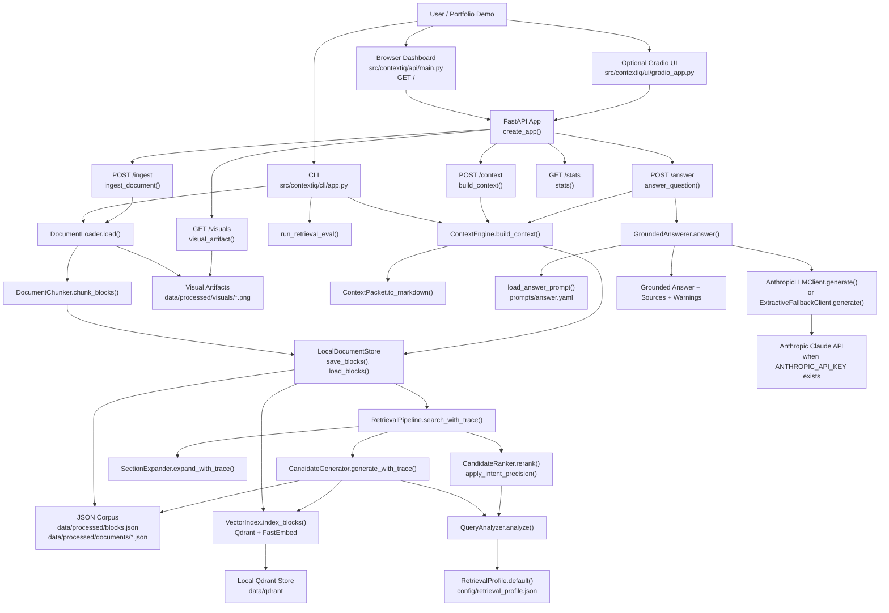
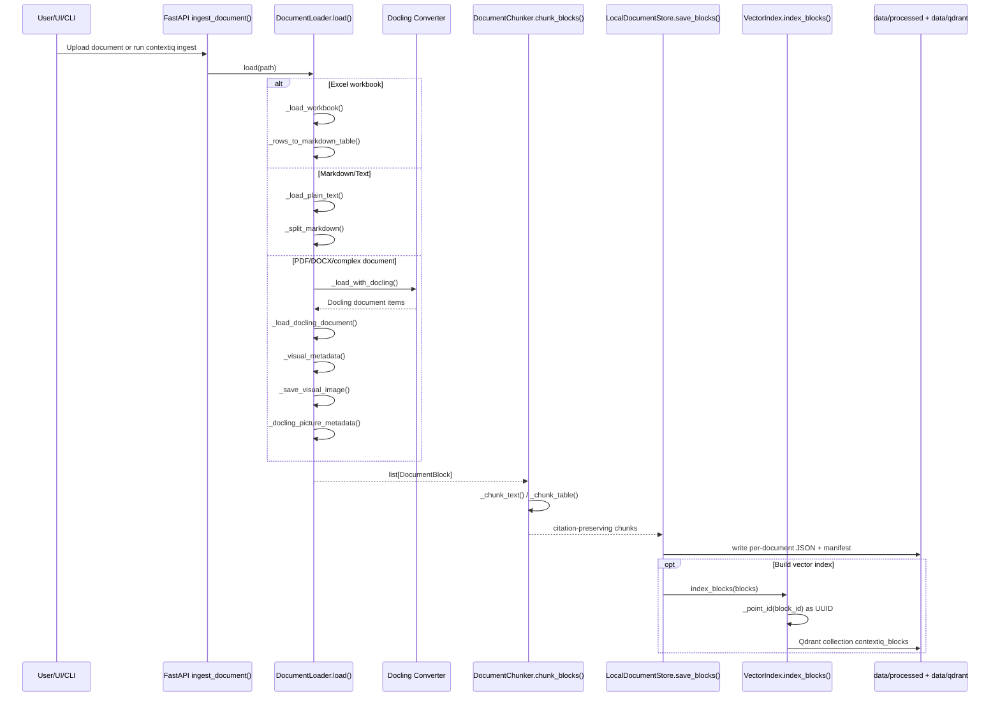
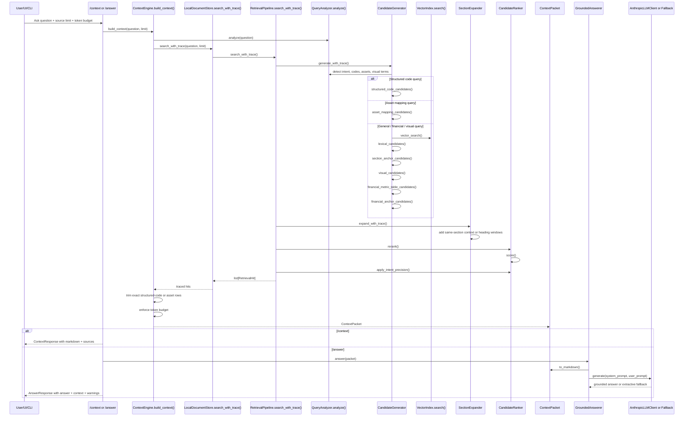
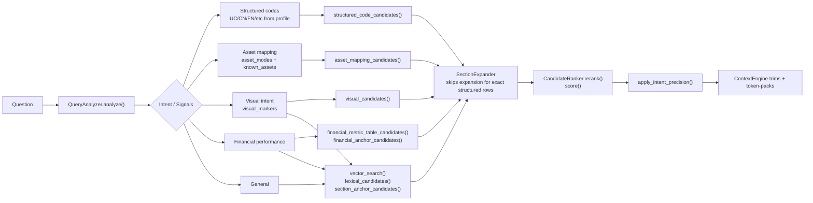

# ContextIQ Application Architecture

This document maps the current ContextIQ codebase into a visual flow. It is meant to be reviewed and corrected as the product evolves.

## High-Level System

## Ingestion Flow

## Retrieval And Answer Flow

## Main Files And Responsibilities

| Area | File | Key classes/functions | Responsibility |
|---|---|---|---|
| API | `src/contextiq/api/main.py` | `create_app()`, `ingest_document()`, `build_context()`, `answer_question()`, `_context_response()`, `_resolve_visual_artifact()` | FastAPI backend, lightweight dashboard, upload, context, answer, stats, visual artifact serving. |
| CLI | `src/contextiq/cli/app.py` | `ingest()`, `ask()`, `inspect_context()`, `eval_retrieval()` | Terminal workflow for ingest, retrieval smoke tests, corpus stats, retrieval evals. |
| Ingestion | `src/contextiq/ingestion/loader.py` | `DocumentLoader.load()`, `_load_with_docling()`, `_load_docling_document()`, `_load_workbook()`, `_visual_metadata()`, `_save_visual_image()` | Converts PDFs, Office-like docs, markdown/text, and Excel into `DocumentBlock`s with sections, pages, tables, figures, visual metadata, and image artifacts. |
| Chunking | `src/contextiq/ingestion/chunking.py` | `DocumentChunker.chunk_blocks()`, `_chunk_text()`, `_chunk_table()` | Splits long text and large tables with overlap while preserving parent metadata. |
| Data model | `src/contextiq/ingestion/models.py` | `BlockType`, `DocumentBlock` | Common block schema for text, headings, tables, and figures. |
| Store | `src/contextiq/retrieval/store.py` | `LocalDocumentStore.save_blocks()`, `load_blocks()`, `search_with_trace()`, `index_blocks()` | JSON-backed corpus store plus retrieval pipeline wiring. |
| Vector index | `src/contextiq/retrieval/vector_index.py` | `VectorIndex.index_blocks()`, `search()`, `_point_id()` | Qdrant/FastEmbed semantic index with deterministic UUID point ids. |
| Query analysis | `src/contextiq/retrieval/query.py` | `QueryAnalyzer.analyze()`, `extract_structured_codes()`, `extract_asset_modes()`, `extract_visual_terms()` | Converts user question into intent, normalized terms, exact codes, asset modes, asset terms, visual intent. |
| Retrieval profile | `src/contextiq/retrieval/profile.py` | `RetrievalProfile.default()`, `from_mapping()` | Loads corpus/domain vocabulary from `config/retrieval_profile.json` instead of hardcoding it in code. |
| Candidate generation | `src/contextiq/retrieval/candidates.py` | `CandidateGenerator.generate_with_trace()`, `structured_code_candidates()`, `asset_mapping_candidates()`, `visual_candidates()`, `lexical_candidates()` | First-pass retrieval from exact structured signals, vector search, lexical search, section anchors, visual evidence, and financial tables. |
| Expansion | `src/contextiq/retrieval/expansion.py` | `SectionExpander.expand_with_trace()` | Adds nearby heading/section context around retrieved blocks. |
| Ranking | `src/contextiq/retrieval/ranker.py` | `CandidateRanker.rerank()`, `score()`, `apply_intent_precision()`, `structured_code_bonus()`, `asset_mapping_bonus()`, `visual_evidence_bonus()` | Scores candidates, filters irrelevant docs, applies intent-specific precision gates. |
| Context engine | `src/contextiq/context/engine.py` | `ContextEngine.build_context()`, `_trim_structured_code_table()`, `_trim_asset_mapping_table()` | Builds token-budgeted context packets and trims large tables down to the exact relevant rows. |
| Context model | `src/contextiq/context/models.py` | `ContextPacket.to_markdown()`, `_format_visual_metadata()` | Serializes evidence, trace, page/section, token counts, visual metadata, and source text. |
| LLM synthesis | `src/contextiq/llm/answerer.py` | `GroundedAnswerer.answer()`, `_default_client()`, `_generate_safely()`, `_grounding_warnings()` | Turns context packet into grounded answer using Anthropic or safe fallback. |
| LLM client | `src/contextiq/llm/client.py` | `AnthropicLLMClient.generate()`, `ExtractiveFallbackClient.generate()` | Provider boundary for answer generation. |
| Prompt | `src/contextiq/llm/prompts.py` and `prompts/answer.yaml` | `load_answer_prompt()`, `AnswerPrompt.render_user()` | Loads the grounded-answer system/user prompt. |
| Eval | `src/contextiq/evals/retrieval.py` | `load_qrels()`, `run_retrieval_eval()`, `evaluate_ranked_blocks()` | Measures recall, precision, MRR, and NDCG against qrels. |

## Data Artifacts

| Artifact | Path | Produced by | Used by |
|---|---|---|---|
| Raw uploads | `data/raw/*` | API `/ingest` or manual copy | `DocumentLoader.load()` |
| Manifest | `data/processed/blocks.json` | `LocalDocumentStore.save_blocks()` | `LocalDocumentStore.load_blocks()` |
| Per-document block JSON | `data/processed/documents/*.json` | `LocalDocumentStore.save_blocks()` | Retrieval pipeline |
| Visual crops | `data/processed/visuals/**/*.png` | `DocumentLoader._save_visual_image()` | API `/visuals`, UI source cards, context markdown |
| Vector DB | `data/qdrant` | `VectorIndex.index_blocks()` | `VectorIndex.search()` |
| Retrieval vocabulary | `config/retrieval_profile.json` | Maintained manually / later auto-profiled | `RetrievalProfile.default()` |
| Answer prompt | `prompts/answer.yaml` | Maintained manually | `GroundedAnswerer.answer()` |
| Eval qrels | `tests/evals/qrels/retrieval_seed.json` | Maintained manually | `contextiq eval-retrieval` |

## Current Retrieval Strategy

## Portfolio Talking Points

- Docling is used for complex PDFs and visual artifacts: page images, picture images, figure/table metadata, captions, classes, descriptions when Docling provides them.
- Retrieval works without the LLM. The LLM only appears after retrieval, when `/answer` calls `GroundedAnswerer.answer()`.
- Qdrant stores vectors for semantic retrieval, while JSON remains the citation/source-of-truth store.
- `config/retrieval_profile.json` holds demo/domain vocabulary, keeping corpus-specific terms out of core retrieval code.
- The context packet is explicit and inspectable before answer generation, which supports evaluation and groundedness debugging.
